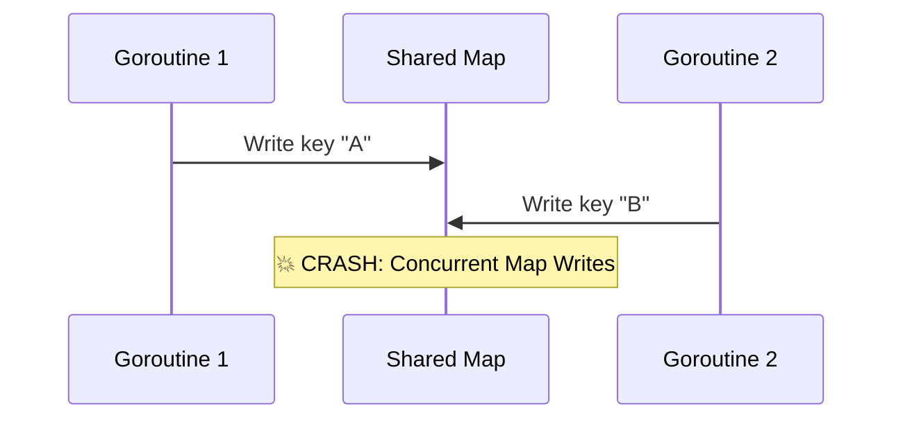
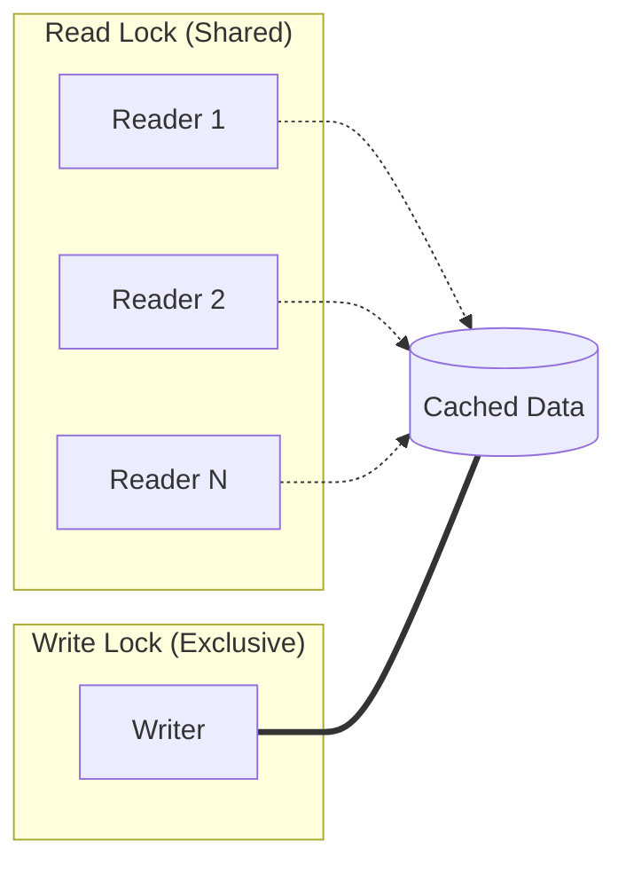

# Thread-Safe Cache Implementation 🧠

A **Cache** is a temporary storage area used to store frequently accessed data for faster retrieval. In a concurrent environment like Go, shared maps must be protected to prevent race conditions.

## 📌 Table of Contents
- [Why Thread-Safety?](#⚖️-why-thread-safety)
- [Mutex vs. RWMutex](#🔒-mutex-vs-rwmutex)
- [Implementation (Concrete)](#🛠-implementation-concrete)
- [Implementation (Interface-based)](#🧩-implementation-interface-based)
- [Performance & Comparison](#⚡-performance--comparison)
- [Interview Deep Dive](#🧠-interview-deep-dive)

---

## ⚖️ Why Thread-Safety?
In Go, **maps are not thread-safe** for concurrent writes. If one goroutine is writing to a map while another is reading or writing, the program will crash with a fatal error: `fatal error: concurrent map writes`.

### Visualizing Race Conditions


---

## 🔒 Mutex vs. RWMutex
For caches, we usually prefer `sync.RWMutex` over a standard `sync.Mutex`.

| Type | When to use | Behavior |
| :--- | :--- | :--- |
| **Mutex** | Read/Write balance is equal | Only one goroutine can access the data at any time. |
| **RWMutex** | Heavy Read, Light Write | **Multiple readers** can hold the lock simultaneously, but only **one writer** can hold it. |

### RWMutex Flow


---

## 🛠 Implementation (Concrete)
This is a standard thread-safe cache using a struct and `sync.RWMutex`.

<details>
<summary><strong>View Implementation</strong></summary>

```go
package main

import (
	"fmt"
	"sync"
)

type Cache struct {
	mu sync.RWMutex
	m  map[string]string
}

func NewCache() *Cache {
	return &Cache{
		m: make(map[string]string),
	}
}

func (c *Cache) Set(k, v string) {
	c.mu.Lock()         // Exclusive Write Lock
	defer c.mu.Unlock()
	c.m[k] = v
}

func (c *Cache) Get(k string) (string, bool) {
	c.mu.RLock()        // Shared Read Lock
	defer c.mu.RUnlock()
	val, ok := c.m[k]
	return val, ok
}

func (c *Cache) Delete(k string) {
	c.mu.Lock()
	defer c.mu.Unlock()
	delete(c.m, k)
}

func main() {
	cache := NewCache()
	cache.Set("user_1", "Alok")
	
	if val, ok := cache.Get("user_1"); ok {
		fmt.Println("Found:", val)
	}
}
```
</details>

---

## 🧩 Implementation (Interface-based)
Using an interface allows you to swap the cache implementation (e.g., for testing or replacing it with an in-memory DB like Redis).

<details>
<summary><strong>View Interface Example</strong></summary>

```go
type CacheStore interface {
	Set(string, string)
	Get(string) (string, bool)
	Delete(string)
}

// In main or your service:
var store CacheStore = NewCache()
```
</details>

---

## ⚡ Performance & Comparison

### When to use this custom implementation?
- For small datasets that fit in memory.
- When you don't need advanced features like TTL (Time To Live) or LRU (Least Recently Used) eviction.

### Production Alternatives
If you need automated cleanup (eviction), consider:
1. **[go-cache](https://github.com/patrickmn/go-cache)**: Basic TTL support.
2. **[bigcache](https://github.com/allegro/bigcache)**: Optimized for millions of items (GC-friendly).
3. **[sync.Map](https://pkg.go.dev/sync#Map)**: A built-in Go map optimized for specific use cases (stable keys, disproportionate reads).

---

## 🧠 Interview Deep Dive

### High-Level Answer
> "To implement a thread-safe cache in Go, I use a `struct` that wraps a `map` and a `sync.RWMutex`. The `RWMutex` is critical for performance because it allows multiple concurrent readers, which is the most common operation in a cache, while ensuring exclusive access for writes."

### Common Pitfalls
- **Deadlocks**: Locking the same mutex twice in the same goroutine (always use `defer`).
- **Memory Leaks**: Never deleting keys from the map; the map will grow until the process runs out of memory.
- **Lock Contention**: If many goroutines are writing frequently, the `RWMutex` can become a bottleneck. In such cases, **sharding** the cache (multiple maps with separate locks) can improve performance.

---
[Back to Top](#thread-safe-cache-implementation-🧠)
