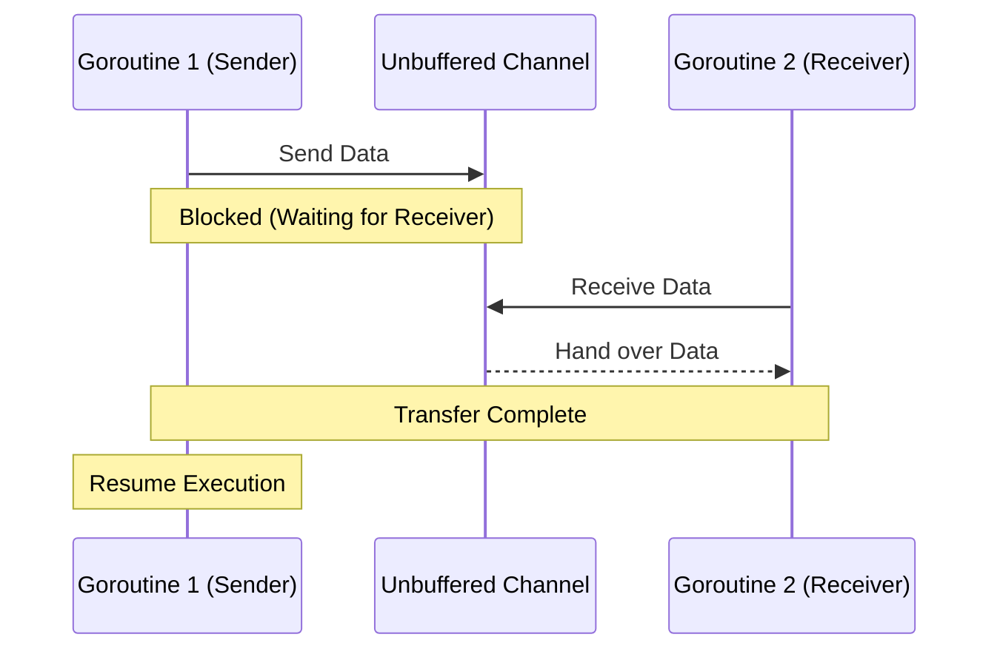
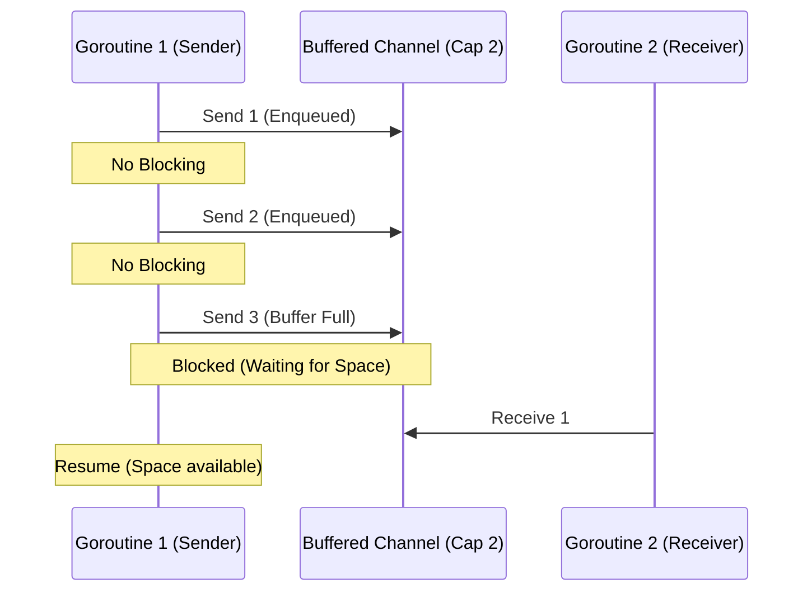
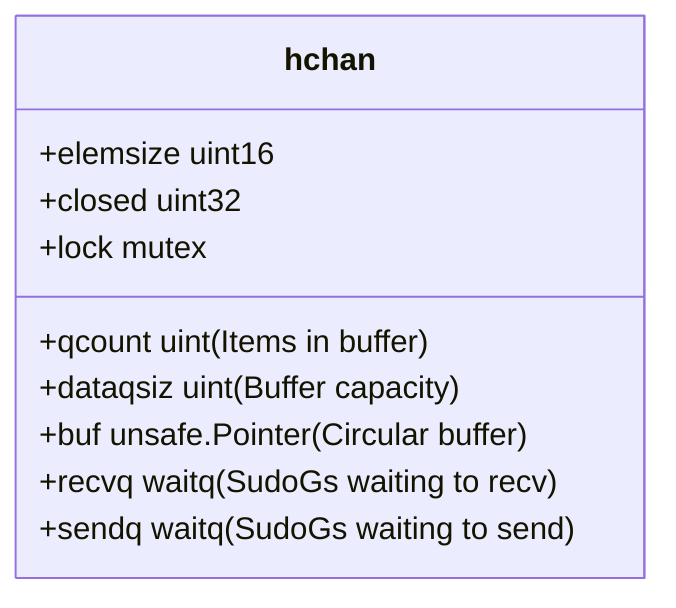

# Channels

Channels are a core concurrency feature in Go used for communication between goroutines.

Go follows the philosophy:
> "Do not communicate by sharing memory; share memory by communicating."

Channels allow goroutines to send and receive data safely without explicit locks.

## Table of Contents
- [1️⃣ Channel Basics](#1️⃣-channel-basics)
- [2️⃣ Unbuffered Channels (Synchronous)](#2️⃣-unbuffered-channels-synchronous)
- [3️⃣ Buffered Channels (Asynchronous)](#3️⃣-buffered-channels-asynchronous)
- [4️⃣ Select Statement](#4️⃣-select-statement)
- [5️⃣ Channel Directions](#5️⃣-channel-directions)
- [6️⃣ Closing & Range](#6️⃣-closing--range)
- [7️⃣ Advanced Patterns](#7️⃣-advanced-patterns)
- [8️⃣ Internals: Under the Hood](#8️⃣-internals-under-the-hood)
- [9️⃣ Common Pitfalls & Mistakes](#9️⃣-common-pitfalls--mistakes)
- [🔟 Interview Preparation](#🔟-interview-preparation)
- [✅ Summary](#✅-summary)

---

## 1️⃣ Channel Basics

A channel is a typed conduit through which goroutines communicate.

**Syntax**
```go
ch := make(chan int)
```

**Example:**
```go
package main
import "fmt"

func main() {
	ch := make(chan int)

	go func() {
		ch <- 10
	}()

	val := <-ch
	fmt.Println(val)
}
```

[Back to Top](#table-of-contents)

---

## 2️⃣ Unbuffered Channels (Synchronous)

Default channels are unbuffered. Communication is synchronous: the sender waits until the receiver is ready, and vice versa.

`send blocks until receive happens`

### Flow Visualization


[Back to Top](#table-of-contents)

---

## 3️⃣ Buffered Channels (Asynchronous)

Buffered channels allow sending values without an immediate receiver, up to a specified capacity.

**Syntax:**
```go
ch := make(chan int, capacity)
```

**Blocking Behavior**
- **Send**: Blocks when the buffer is **full**.
- **Receive**: Blocks when the buffer is **empty**.

### Flow Visualization


[Back to Top](#table-of-contents)

---

## 4️⃣ Select Statement

The `select` statement lets a goroutine wait on multiple communication operations. It is a fundamental pattern for multiplexing channels.

- If multiple cases are ready, one is chosen **pseudo-randomly**.
- If none are ready, it blocks (unless a `default` case exists).

<details>
<summary><strong>View Select Patterns</strong></summary>

```go
package main

import (
	"fmt"
	"time"
)

func main() {
	ch1 := make(chan string)
	ch2 := make(chan string)

	go func() { time.Sleep(1 * time.Second); ch1 <- "one" }()
	go func() { time.Sleep(2 * time.Second); ch2 <- "two" }()

	for i := 0; i < 2; i++ {
		select {
		case msg1 := <-ch1:
			fmt.Println("Received", msg1)
		case msg2 := <-ch2:
			fmt.Println("Received", msg2)
		case <-time.After(3 * time.Second):
			fmt.Println("Timeout")
		}
	}
}
```
</details>

### Common `select` Use Cases
1. **Timeouts**: `case <-time.After(d):`.
2. **Non-blocking checks**: `default:` case.
3. **Graceful Shutdown**: `case <-done:`.

[Back to Top](#table-of-contents)

---

## 5️⃣ Channel Directions

Channels can be restricted to send-only or receive-only for better type safety and API design.

```go
// Send-only
func producer(ch chan<- int) { ch <- 100 }

// Receive-only
func consumer(ch <-chan int) { fmt.Println(<-ch) }
```

[Back to Top](#table-of-contents)

---

## 6️⃣ Closing & Range

### Closing Channels
- **Rule**: Only the sender should close a channel.
- **Panic**: Sending to a closed channel or closing it twice causes a panic.
- **Detection**: Use the `v, ok := <-ch` syntax. `ok` is `false` if the channel is empty and closed.

### Range Over Channels
`for v := range ch` reads values until the channel is closed.

```go
func main() {
    ch := make(chan int)
    go func() {
        for i := 1; i <= 3; i++ { ch <- i }
        close(ch)
    }()

    for val := range ch {
        fmt.Println(val)
    }
}
```

[Back to Top](#table-of-contents)

---

## 7️⃣ Advanced Patterns

### Or-Done Channel
Combines multiple `done` channels into one. If any of the input channels close, the returned channel closes.

```go
func or(channels ...<-chan interface{}) <-chan interface{} {
    switch len(channels) {
    case 0: return nil
    case 1: return channels[0]
    }
    orDone := make(chan interface{})
    go func() {
        defer close(orDone)
        switch len(channels) {
        case 2:
            select {
            case <-channels[0]:
            case <-channels[1]:
            }
        default:
            select {
            case <-channels[0]:
            case <-or(append(channels[1:], orDone)...):
            }
        }
    }()
    return orDone
}
```

### Done-Channel Pattern
A reliable way to signal goroutines to clean up and exit.

```go
func worker(done <-chan struct{}) {
    for {
        select {
        case <-done:
            return
        default:
            // Do work...
        }
    }
}
```

[Back to Top](#table-of-contents)

---

## 8️⃣ Internals: Under the Hood

Go channels are implemented as a circular buffer protected by a mutex. The runtime structure is called `hchan`.

### The `hchan` Structure


### Key Internal Components
- **`buf`**: A circular array that stores data (only for buffered channels).
- **`sendq` & `recvq`**: Linked lists of `SudoG` structures representing goroutines blocked on this channel.
- **`lock`**: Every channel operation requires acquiring this mutex. **Channels are not lock-free.**

[Back to Top](#table-of-contents)

---

## 9️⃣ Common Pitfalls & Mistakes

1. **Deadlock**: Sending to a channel without a concurrent receiver (for unbuffered channels).
2. **Goroutine Leak**: A goroutine blocked on a channel that is never closed or read.
3. **Panic**: Sending to a `nil` channel blocks forever; closing a `nil` channel panics.
4. **Closing twice**: `panic: close of closed channel`.

[Back to Top](#table-of-contents)

---

## 🔟 Interview Preparation

**1️⃣ Difference between buffered and unbuffered channels?**
Unbuffered is synchronous (rendezvous), while buffered is asynchronous until the buffer is full.

**2️⃣ What happens when you read from a closed channel?**
You receive the zero value of the channel's type. Use `v, ok := <-ch` to check if it's actually closed.

**🔥 Senior Level Question: Are channels lock-free?**
No. They use a mutex (`hchan.lock`) for all operations. However, for most use cases, the overhead is negligible compared to the safety they provide.

[Back to Top](#table-of-contents)

---

## ✅ Summary

Channels are the backbone of Go's concurrency model. They provide:
- **Synchronization**: Coordinates goroutines without manual locks.
- **Communication**: Safe data transfer.
- **Memory Safety**: Encourages ownership transfer rather than shared access.

---
[Back to Top](#channels)