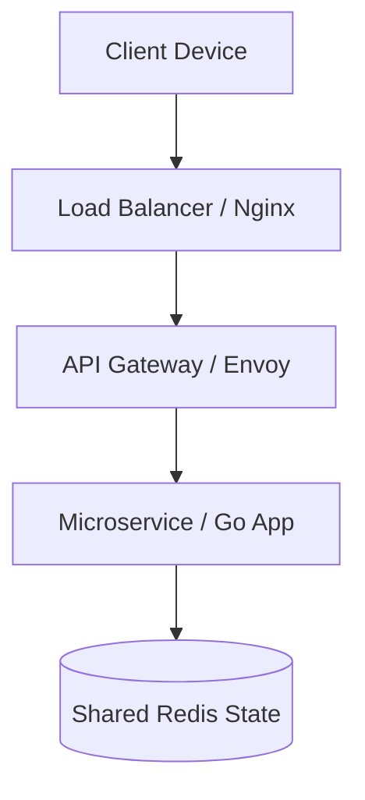

# Rate Limiting Pattern 🛡️

## 📌 Table of Contents
- [Concept & Importance](#🏗-concept--importance)
- [Rate Limiting Algorithms](#⚙-rate-limiting-algorithms)
- [Basic Implementation (`x/time/rate`)](#⚒-basic-implementation)
- [Production: HTTP Middleware](#🛡-production-http-middleware)
- [Advanced: Per-User Rate Limiting](#👤-advanced-per-user-rate-limiting)
- [Architecture & Tools](#🌐-architecture--tools)
- [Interview Deep Dive](#🧠-interview-deep-dive)
- [Rate Limiter vs. Worker Pool](#📊-rate-limiter-vs-worker-pool)

---

## 🏗 Concept & Importance
A **Rate Limiter** controls the rate of traffic sent or received by a network interface or a service. It is a critical component for building robust systems that can withstand traffic spikes and prevent resource exhaustion.

### Why use it?
- **Prevent Overload**: Keep your servers from crashing during traffic spikes.
- **Fair Usage**: Ensure no single user consumes all available resources.
- **Security**: Mitigate brute-force attacks and DDoS attempts.
- **Cost Control**: Limit usage of expensive third-party APIs.

---

## ⚙ Rate Limiting Algorithms

### 1. Token Bucket (Most Common)
Tokens are added to a "bucket" at a fixed rate. Each request must consume a token. If the bucket is empty, the request is rejected.
- **Pros**: Supports bursts of traffic.
- **Used by**: Go's `golang.org/x/time/rate`.

### 2. Leaky Bucket
Requests enter a queue and are processed (leak out) at a constant rate.
- **Pros**: Perfectly smooths out traffic.

### 3. Fixed Window
Requests are counted within fixed time windows (e.g., 100 req/min).
- **Cons**: Can allow double the traffic at window boundaries (the "boundary problem").

### 4. Sliding Window Log / Counter
A more accurate version of the window algorithm that tracks a rolling time window.

---

## ⚒ Basic Implementation
Go provides the `golang.org/x/time/rate` package, which implements the Token Bucket algorithm.

<details>
<summary><strong>View Basic Example</strong></summary>

```go
package main

import (
	"context"
	"fmt"
	"golang.org/x/time/rate"
	"time"
)

func main() {
	// 2 tokens per second, burst of 4
	limiter := rate.NewLimiter(rate.Every(500*time.Millisecond), 4)
	ctx := context.Background()

	for i := 1; i <= 10; i++ {
		// Wait blocks until a token is available
		if err := limiter.Wait(ctx); err != nil {
			fmt.Printf("Error: %v\n", err)
			return
		}
		fmt.Printf("Request %d allowed at %v\n", i, time.Now().Format("15:04:05.000"))
	}
}
```
</details>

---

## 🛡 Production: HTTP Middleware
In a real web server, you typically use rate limiting as middleware.

<details>
<summary><strong>View Middleware Example</strong></summary>

```go
package main

import (
	"net/http"
	"golang.org/x/time/rate"
)

var globalLimiter = rate.NewLimiter(1, 3) // 1 req/sec, burst 3

func limitMiddleware(next http.Handler) http.Handler {
	return http.HandlerFunc(func(w http.ResponseWriter, r *http.Request) {
		if !globalLimiter.Allow() {
			http.Error(w, "Too Many Requests", http.StatusTooManyRequests)
			return
		}
		next.ServeHTTP(w, r)
	})
}

func main() {
	mux := http.NewServeMux()
	mux.HandleFunc("/", func(w http.ResponseWriter, r *http.Request) {
		w.Write([]byte("Hello, limited world!"))
	})

	http.ListenAndServe(":8080", limitMiddleware(mux))
}
```
</details>

---

## 👤 Advanced: Per-User Rate Limiting
Production systems usually track limits per IP address or API key.

<details>
<summary><strong>View Per-IP Example</strong></summary>

```go
package main

import (
	"sync"
	"golang.org/x/time/rate"
	"net/http"
)

type IPlimiter struct {
	ips map[string]*rate.Limiter
	mu  sync.Mutex
}

func (i *IPlimiter) getLimiter(ip string) *rate.Limiter {
	i.mu.Lock()
	defer i.mu.Unlock()

	limiter, exists := i.ips[ip]
	if !exists {
		// Define limit: 1 req/sec, burst 5
		limiter = rate.NewLimiter(1, 5)
		i.ips[ip] = limiter
	}
	return limiter
}

var visitorLimiter = &IPlimiter{ips: make(map[string]*rate.Limiter)}

func limitByIP(next http.Handler) http.Handler {
	return http.HandlerFunc(func(w http.ResponseWriter, r *http.Request) {
		ip := r.RemoteAddr // Simplified, in prod use X-Forwarded-For
		if !visitorLimiter.getLimiter(ip).Allow() {
			http.Error(w, "Rate limit exceeded", http.StatusTooManyRequests)
			return
		}
		next.ServeHTTP(w, r)
	})
}
```
</details>

---

## 🌐 Architecture & Tools
In distributed systems, rate limiting usually happens at multiple layers:

### Visual Flow


- **API Gateways**: Kong, Tyk, AWS API Gateway.
- **Service Mesh**: Istio, Envoy.
- **Distributed Limiting**: Usually backed by **Redis** to share state across multiple service instances.

---

## 🧠 Interview Deep Dive

### 5+ Years Experience Answer
> "Rate limiting is a mechanism for controlling the rate of consumption. In Go, we use the `x/time/rate` package for local limiting, which implements the Token Bucket algorithm. For distributed systems, we usually implement a custom middleware that uses Redis `SETNX` or Lua scripts to maintain atomicity and shared state across horizontal instances. This ensures that a single user doesn't hit the limit on Instance A but gets a fresh start on Instance B."

### Common Pitfalls
- **Distributed Drift**: Local limiters ignore other instances.
- **Memory Leaks**: Letting the "per-IP" map grow forever without a cleanup background routine.
- **Inaccurate IP**: Trusting `r.RemoteAddr` behind a proxy (always check headers).

---

## 📊 Rate Limiter vs. Worker Pool
Interviewers often compare these two patterns.

| Feature | Rate Limiter | Worker Pool |
| :--- | :--- | :--- |
| **Focus** | Request Timing / Arrival | Concurrency / Processing |
| **Purpose** | Protect External/Internal Systems | Parallelize Computation |
| **Mechanism** | Drop or delay incoming requests | Queue tasks for available workers |
| **Example** | 100 API Calls per Minute | 5 Goroutines for image processing |

---
[Back to Top](#rate-limiting-pattern-🛡️)
