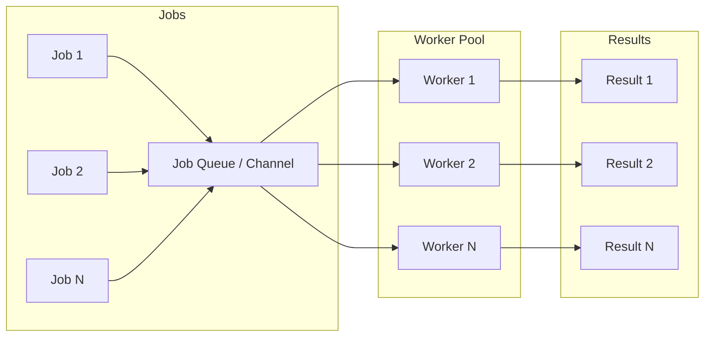

# Worker Pool Pattern 👷‍♂️

## 📌 Table of Contents
- [Concept & Architecture](#🏗-concept--architecture)
- [Why Use Worker Pools?](#🚀-why-use-worker-pools)
- [Real-World Use Cases](#📂-real-world-use-cases)
- [Basic Implementation](#⚒-basic-implementation)
- [Generic Worker Pool (Go 1.18+)](#🧩-generic-worker-pool-go-118)
- [Production-Ready Implementation](#🛡-production-ready-implementation)
- [Advanced: Error Handling with `errgroup`](#💣-advanced-error-handling-with-errgroup)
- [Performance & Tuning](#⚡-performance--tuning)
- [Interview Deep Dive](#🧠-interview-deep-dive)
- [Resources](#📚-resources)

---

## 🏗 Concept & Architecture
A **Worker Pool** is a concurrency pattern where a fixed number of goroutines (workers) process tasks from a shared job queue (channel). This prevents resource exhaustion by limiting the number of active goroutines, regardless of the number of submitted tasks.

### Visual Flow


---

## 🚀 Why Use Worker Pools?
- **Resource Control**: Limits CPU and memory usage by capping the number of active goroutines.
- **Backpressure**: Balances the rate of task production with the rate of consumption.
- **Rate Limiting**: Useful when interacting with external systems (APIs, Databases) that have concurrency limits.
- **Improved Performance**: Reduces scheduler overhead and context switching compared to creating "unlimited" goroutines.

---

## 📂 Real-World Use Cases
1. **Background Job Processing**: Sending emails, resizing images, generating reports.
2. **API Interaction**: Calling third-party APIs with specific rate limits.
3. **Data Pipelines**: Batch processing millions of records from a database or message queue (Kafka, RabbitMQ).
4. **Scraping/Crawling**: Fetching data from multiple URLs concurrently while limiting simultaneous connections.

---

## ⚒ Basic Implementation
A fundamental worker pool using channels to distribute tasks.

<details>
<summary><strong>View Solution</strong></summary>

```go
package main

import (
    "fmt"
    "time"
)

func worker(id int, jobs <-chan int, results chan<- int) {
    for j := range jobs {
        fmt.Printf("Worker %d started job %d\n", id, j)
        time.Sleep(time.Second) // Simulate work
        results <- j * 2
    }
}

func main() {
    const numJobs = 5
    const numWorkers = 3

    jobs := make(chan int, numJobs)
    results := make(chan int, numJobs)

    // Start workers
    for w := 1; w <= numWorkers; w++ {
        go worker(w, jobs, results)
    }

    // Submit jobs
    for j := 1; j <= numJobs; j++ {
        jobs <- j
    }
    close(jobs) // Signal that no more jobs will be sent

    // Collect results
    for a := 1; a <= numJobs; a++ {
        fmt.Println("Result:", <-results)
    }
}
```
</details>

---

## 🧩 Generic Worker Pool (Go 1.18+)
Using Generics allows you to create reusable worker pool logic that isn't tied to a specific data type.

<details>
<summary><strong>View Solution</strong></summary>

```go
package main

import (
	"fmt"
	"sync"
)

// Task is a generic wrapper for a function that returns a result
type Task[T any, R any] struct {
	ID   int
	Data T
	Func func(T) R
}

func genericWorker[T any, R any](id int, tasks <-chan Task[T, R], results chan<- R, wg *sync.WaitGroup) {
	defer wg.Done()
	for t := range tasks {
		fmt.Printf("Worker %d processing task %d\n", id, t.ID)
		results <- t.Func(t.Data)
	}
}

func main() {
	tasks := make(chan Task[string, int], 10)
	results := make(chan int, 10)
	var wg sync.WaitGroup

	// Start 3 workers
	for i := 1; i <= 3; i++ {
		wg.Add(1)
		go genericWorker(i, tasks, results, &wg)
	}

	// Submit tasks
	jobFunc := func(s string) int { return len(s) }
	words := []string{"apple", "banana", "cherry", "date"}
	for i, w := range words {
		tasks <- Task[string, int]{ID: i, Data: w, Func: jobFunc}
	}
	close(tasks)

	// Wait for workers in a separate goroutine to avoid blocking
	go func() {
		wg.Wait()
		close(results)
	}()

	for res := range results {
		fmt.Println("Result:", res)
	}
}
```
</details>

---

## 🛡 Production-Ready Implementation
In production, you should use `sync.WaitGroup` for proper termination tracking and `context.Context` for graceful shutdowns.

<details>
<summary><strong>View Solution</strong></summary>

```go
package main

import (
    "context"
    "fmt"
    "sync"
    "time"
)

type Job struct {
    ID int
}

func worker(ctx context.Context, id int, jobs <-chan Job, wg *sync.WaitGroup) {
    defer wg.Done()
    for {
        select {
        case <-ctx.Done():
            fmt.Printf("Worker %d: shutting down\n", id)
            return
        case job, ok := <-jobs:
            if !ok {
                return
            }
            fmt.Printf("Worker %d: processing job %d\n", id, job.ID)
            time.Sleep(500 * time.Millisecond) // Simulate work
        }
    }
}

func main() {
    ctx, cancel := context.WithCancel(context.Background())
    defer cancel()

    const numWorkers = 3
    jobs := make(chan Job, 10)
    var wg sync.WaitGroup

    // Start workers
    for w := 1; w <= numWorkers; w++ {
        wg.Add(1)
        go worker(ctx, 100+w, jobs, &wg)
    }

    // Submit some jobs
    for i := 1; i <= 5; i++ {
        jobs <- Job{ID: i}
    }

    time.Sleep(2 * time.Second)
    fmt.Println("Main: cancelling context...")
    cancel()

    close(jobs)
    wg.Wait()
    fmt.Println("Main: all workers stopped")
}
```
</details>

---

## 💣 Advanced: Error Handling with `errgroup`
The `golang.org/x/sync/errgroup` package is the standard way to handle errors in concurrent workers. It returns the first non-nil error from any worker and can naturally handle context cancellation.

<details>
<summary><strong>View Solution</strong></summary>

```go
package main

import (
	"context"
	"errors"
	"fmt"
	"golang.org/x/sync/errgroup"
)

func main() {
	g, ctx := errgroup.WithContext(context.Background())
	jobs := make(chan int, 10)

	// Producer
	g.Go(func() error {
		defer close(jobs)
		for i := 1; i <= 5; i++ {
			select {
			case jobs <- i:
			case <-ctx.Done():
				return ctx.Err()
			}
		}
		return nil
	})

	// Workers
	for w := 1; w <= 3; w++ {
		wID := w
		g.Go(func() error {
			for j := range jobs {
				if j == 4 {
					return errors.New("boom! error in worker")
				}
				fmt.Printf("Worker %d: job %d\n", wID, j)
			}
			return nil
		})
	}

	if err := g.Wait(); err != nil {
		fmt.Printf("Encountered error: %v\n", err)
	} else {
		fmt.Println("Successfully finished all jobs")
	}
}
```
</details>

---

## ⚡ Performance & Tuning

### Choosing the Number of Workers
- **CPU-bound tasks**: Usually `runtime.NumCPU() + 1`. Spawning more workers than cores leads to excessive context switching.
- **I/O-bound tasks**: (Network calls, DB queries) Can be much higher (tens or hundreds) because workers spend most of their time waiting for external systems.

### Channel Selection
- **Unbuffered Channels**: Provide strong synchronization but can cause "jitter" as the producer must wait for a worker to be ready.
- **Buffered Channels**: Smoothens out production spikes but risks concealing latency issues if the buffer stays full (backpressure).

---

## 🧠 Interview Deep Dive

### High-Level Explanation
> "A Worker Pool is a concurrency pattern where a fixed set of goroutines (workers) consume tasks from a shared job queue (channel). This allows us to process many tasks concurrently while strictly limiting resource usage (CPU/Memory) and preventing system overload by capping the total number of active goroutines."

### Common Pitfalls
- **Unbounded Queues**: Creating channels with massive buffers can lead to memory explosion if producers outpace workers.
- **Stray Goroutines**: Forgetting to `close()` the jobs channel or handle context cancellation leads to **goroutine leaks**.
- **Race Conditions**: Sharing state across workers without using `sync.Mutex` or `atomic` package.

### Tips for Senior Engineers
- **Backpressure**: Explain how bounded channels naturally block producers when workers are busy.
- **Graceful Shutdown**: Always discuss `sync.WaitGroup` and `context.Context` for terminating workers cleanly.
- **Error Propagation**: Mention `errgroup` for collecting and handling errors from multiple workers.
- **Work Stealing**: (Advanced) Contrast custom worker pools with Go's internal runtime scheduler which uses work-stealing for its own M:N model.

---

## 📚 Resources
- [Go by Example: Worker Pools](https://gobyexample.com/worker-pools)
- [Go Concurrency Patterns (Rob Pike)](https://go.dev/blog/pipelines)
- [Effective Go: Goroutines](https://go.dev/doc/effective_go#goroutines)
- [Sync Package Documentation](https://pkg.go.dev/sync)

---
[Back to Top](#worker-pool-pattern-👷‍♂️)